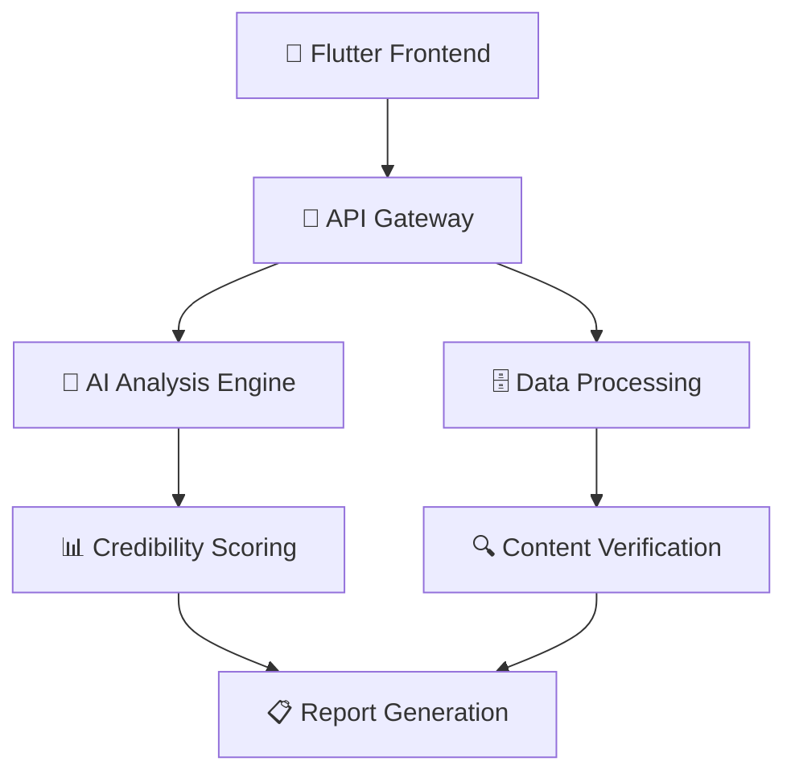

# 🛡️ Falo - AI-Powered Misinformation Detection

<div align="center">


**Your intelligent shield against misinformation in the digital age**

[](https://flutter.dev)
[](https://python.org)
[](https://fastapi.tiangolo.com)
[](https://opensource.org/licenses/MIT)

[🚀 Quick Start](#-quick-start) • [📱 Demo](#-demo) • [🔧 Features](#-features) • [📖 Docs](#-documentation) • [🤝 Contribute](#-contributing)

</div>

---

## 🔧 Features

<table>
<tr>
<td width="50%">

### 🤖 **AI-Powered Analysis**
Instantly assess text and URL credibility with advanced machine learning algorithms

### 🗣️ **Voice Commands**
Hands-free verification using voice input technology

### 🌙 **Dark Mode**
Comfortable viewing experience in any lighting condition

</td>
<td width="50%">

### 📊 **Detailed Reports**
Comprehensive breakdowns with confidence scores and evidence

### 🌐 **Cross-Platform**
Available on iOS, Android, and web platforms

### ⚡ **Real-time Analysis**
Get instant results with lightning-fast processing

</td>
</tr>
</table>

---

## 📱 Demo

<div align="center">

### 🎬 **See Falo in Action**

https://github.com/user-attachments/assets/demo-video-placeholder

*Demo Video: Experience Falo's misinformation detection capabilities*

</div>

<details>
<summary>📸 <strong>Click to view App Screenshots</strong></summary>

<div align="center">
<table>
<tr>
<td align="center" width="33%">

<br><strong>Welcome Screen</strong>
<br><em>Clean, friendly interface</em>
</td>
<td align="center" width="33%">

<br><strong>Analysis Hub</strong>
<br><em>Text & URL verification</em>
</td>
<td align="center" width="33%">

<br><strong>Getting Started</strong>
<br><em>User-friendly onboarding</em>
</td>
</tr>
<tr>
<td align="center" width="33%">

<br><strong>Interactive Chat</strong>
<br><em>Natural language queries</em>
</td>
<td align="center" width="33%">

<br><strong>Voice Commands</strong>
<br><em>Hands-free operation</em>
</td>
<td align="center" width="33%">

<br><strong>Detailed Results</strong>
<br><em>Comprehensive analysis</em>
</td>
</tr>
</table>
</div>

</details>

---

## 🏗️ Architecture

<div align="center">



</div>

<details>
<summary>📁 <strong>Project Structure</strong></summary>

```bash
Falo/
├── 📱 Frontend/              # Flutter mobile application
│   └── Falo/                # Main Flutter project
│       ├── lib/             # Dart source code
│       ├── assets/          # Images, fonts, etc.
│       └── pubspec.yaml     # Dependencies
├── 🔧 backend/              # Python backend service
│   └── misinfo_detection_project/
│       ├── api/             # FastAPI endpoints
│       ├── config/          # Configuration files
│       ├── data/            # Data storage
│       └── requirements.txt # Python dependencies
└── 📸 Falotestphoto/        # Screenshots & demo assets
    └── DemoVideo.mp4        # Application demo video
```

</details>

---

## 🚀 Quick Start

<details>
<summary><strong>📋 Prerequisites</strong></summary>

### Mobile Development
- Flutter SDK (latest stable)
- Android Studio / Xcode
- VS Code or Android Studio

### Backend Development
- Python 3.8+
- pip package manager
- Virtual environment (recommended)

</details>

### ⚡ One-Click Setup

```bash
# 1️⃣ Clone the repository
git clone https://github.com/GokulanV7/Falo-app.git && cd Falo

# 2️⃣ Backend setup
cd backend/misinfo_detection_project
python -m venv .venv && source .venv/bin/activate  # Windows: .venv\Scripts\activate
pip install -r requirements.txt

# 3️⃣ Frontend setup
cd ../../Frontend/Falo && flutter pub get

# 4️⃣ Launch applications
# Terminal 1: Backend
uvicorn api.main:app --reload

# Terminal 2: Mobile app
flutter run
```

<div align="center">

🎉 **That's it! Falo is now running locally.**

</div>

---

## 📖 Documentation

| 📚 Resource | 🔗 Link | 📝 Description |
|-------------|---------|----------------|
| **Frontend Guide** | [Flutter Docs](./Frontend/Falo/README.md) | Mobile app setup & development |
| **Backend API** | [Python Docs](./backend/misinfo_detection_project/README.md) | API documentation & setup |
| **Live API Docs** | [Interactive API](https://api.falo.app/docs) | Real-time API exploration |

---

## 🤝 Contributing

<div align="center">

We ❤️ contributions from the community!

[](https://github.com/GokulanV7/Falo-app/graphs/contributors)
[](https://github.com/GokulanV7/Falo-app/issues)
[](https://github.com/GokulanV7/Falo-app/pulls)

</div>

### 🎯 How to Contribute

1. **🐛 Report Bugs** → [Open an Issue](https://github.com/GokulanV7/Falo-app/issues/new)
2. **💡 Suggest Features** → [Feature Request](https://github.com/GokulanV7/Falo-app/issues/new)
3. **🔧 Submit Code**:
   ```bash
   git checkout -b feature/amazing-feature
   git commit -m 'Add amazing feature'
   git push origin feature/amazing-feature
   # Open a Pull Request! 🎉
   ```

---

## 📞 Support & Contact

<div align="center">

| 💬 **Need Help?** | 📧 **Business Inquiries** | 📱 **Follow Us** |
|-------------------|-------------------------|------------------|
| [GitHub Issues](https://github.com/GokulanV7/Falo-app/issues) | [contact@falo.app](mailto:contact@falo.app) | [Twitter](https://twitter.com/falo_app) |

</div>

---

## 📜 License

<div align="center">

This project is licensed under the **MIT License** - see the [LICENSE](LICENSE) file for details.

**Made with ❤️ by the Falo Team**

⭐ **Star us on GitHub if you find Falo helpful!**

---

*© 2025 Falo. Fighting misinformation, one verification at a time.*

</div>
