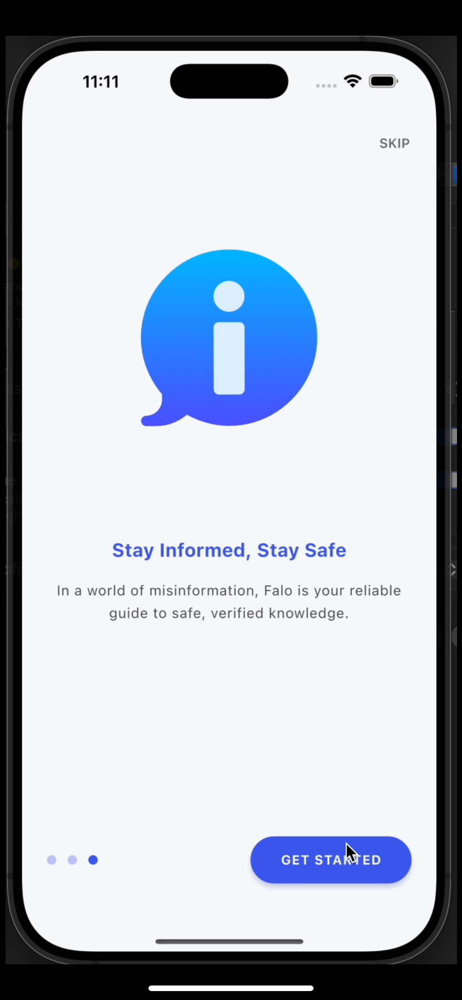
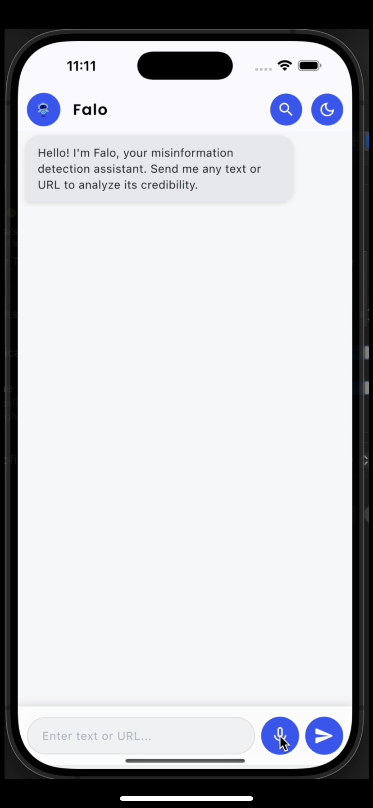
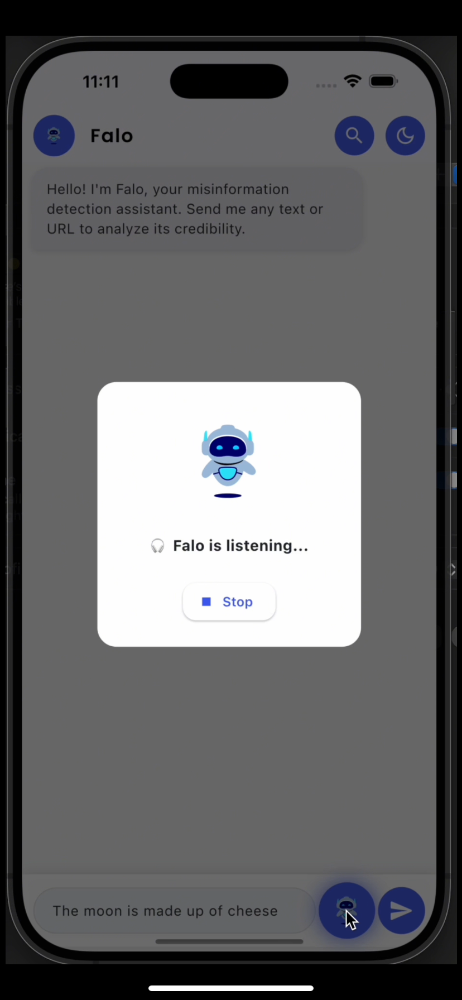
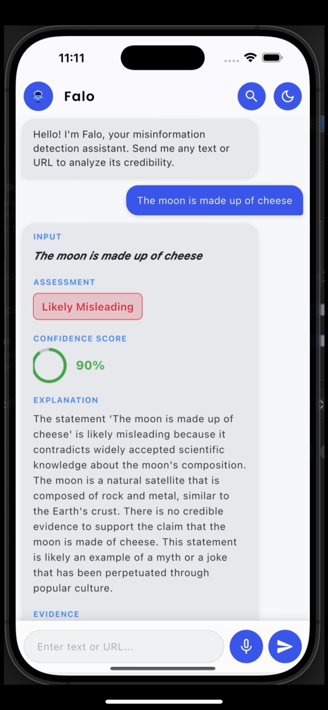

# Falo - Misinformation Detection Platform

Falo is a comprehensive platform designed to detect and combat misinformation across various digital platforms. It consists of a Flutter-based mobile application and a Python-based backend service that works together to analyze and verify the credibility of online content.

## 🌟 Features

- **Cross-platform Mobile App**: Built with Flutter for iOS, Android, and web
- **Content Analysis**: AI-powered verification of news and online content
- **Real-time Detection**: Instant feedback on content credibility
- **Comprehensive Backend**: Robust API for content processing and analysis
- **Multi-source Verification**: Cross-references information from trusted sources

## 🏗 Project Structure

```
Falo/
├── Frontend/           # Flutter mobile application
│   └── Falo/          # Main Flutter project
├── backend/            # Python backend service
│   └── misinfo_detection_project/
│       ├── api/       # FastAPI endpoints
│       ├── config/     # Configuration files
│       └── data/       # Data storage and processing
├── .gitattributes      # Git LFS configuration
└── README.md           # This file
```

## 🚀 Getting Started

### Prerequisites

- **For Mobile Development**:
  - Flutter SDK (latest stable version)
  - Android Studio / Xcode
  - VS Code or Android Studio (recommended)

- **For Backend Development**:
  - Python 3.8+
  - pip (Python package manager)
  - Virtual environment (recommended)

### Quick Start

1. **Clone the repository**
   ```bash
   git clone https://github.com/GokulanV7/Falo-app.git
   cd Falo
   ```

2. **Set up the backend**
   ```bash
   cd backend/misinfo_detection_project
   python -m venv .venv
   source .venv/bin/activate  # On Windows: .venv\Scripts\activate
   pip install -r requirements.txt
   ```

3. **Set up the mobile app**
   ```bash
   cd ../../Frontend/Falo
   flutter pub get
   ```

4. **Run the applications**
   - Backend: `uvicorn api.main:app --reload`
   - Mobile: `flutter run`

## 📱 Screenshots

<div align="center">
  <h3>App Interface</h3>
  
  
  <p>App Home Screen - Main dashboard with navigation options</p>
  
  
  <p>Content Analysis - Detailed breakdown of information credibility</p>
  
  
  <p>Verification - Step-by-step fact-checking interface</p>
  
  
  <p>Source Evaluation - Detailed source credibility assessment</p>
  
  
  <p>Search - Find and analyze specific information</p>
  
  
  <p>User Profile - Track your verification history and preferences</p>
  
  <div style="margin-top: 20px; padding: 15px; background-color: #f8f9fa; border-radius: 5px;">
    <h4>📹 Demo Video Available</h4>
    <p>Would you like to see Falo in action? Contact us for a live demo or to request access to the demonstration video.</p>
  </div>
</div>

## 📚 Documentation

- [Frontend Documentation](./Frontend/Falo/README.md)
- [Backend Documentation](./backend/misinfo_detection_project/README.md)

## 🤝 Contributing

We welcome contributions! Please read our [Contributing Guidelines](CONTRIBUTING.md) to get started.

1. Fork the repository
2. Create your feature branch (`git checkout -b feature/AmazingFeature`)
3. Commit your changes (`git commit -m 'Add some AmazingFeature'`)
4. Push to the branch (`git push origin feature/AmazingFeature`)
5. Open a Pull Request

## 📄 License

This project is licensed under the MIT License - see the [LICENSE](LICENSE) file for details.

## 🙏 Acknowledgments

- Built with Flutter and FastAPI
- Uses state-of-the-art NLP models for content analysis
- Thanks to all contributors who have helped shape this project

---

<div align="center">
  Made with ❤️ by the Falo Team
</div>
